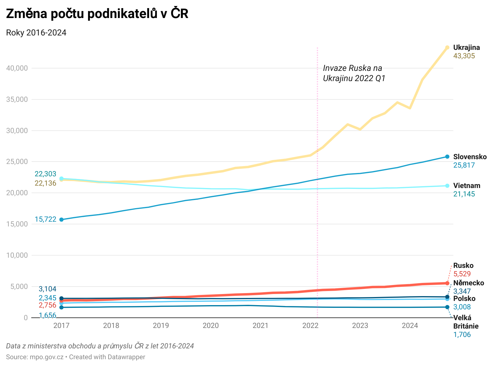

# MUNI kurz Data Kolem nás  
## Podnikatelé v ČR podle národností  
  
Stažení, čištění, shromáždění a analýza proměny počtu podnikatelů v ČR podle národností. Data jsou stažena z [Ministerstva Obchodu a Průmyslu](https://mpo.gov.cz/cz/podnikani/zivnostenske-podnikani/statisticke-udaje-o-podnikatelich/pocty-podnikatelu-dle-obcanstvi-podnikajicich-v-ceske-republice--151024/). 100% Python, Jupyter notebook.  
  
### [Scraper.ipynb](Scraper.ipynb)  
- [x] Inicializace git repozitáře a Jupyter notebooku  
- [x] Stažení dat pomocí scraperu (Playwright async) - 34 záznamů  
- [x] Převod .xlsx souborů se zamčenými listy do csv  

### [Preprocessing.ipynb](Preprocessing.ipynb)
- [x] Manuální upravení názvů "Text" na "YYYY QQ"  
- [x] Preprocessing vzniklých CSV
    - Přejmenování sloupců, odstranění zbytečných sloupců a řádků, nastavení indexu
- [x] Vytvoření listů all_sums a all_dataframes  
- [x] Merge (left outter join) do jednoho  

### [Visualisation.ipynb](Visualisation.ipynb)
- [x] Vizualizace pomocí matplotlib
    - Stacked Area Chart
    - Line Chart
    - 100% Stacked Area Chart
- [x] [Interaktivní vizualizace](https://datawrapper.dwcdn.net/9vA7d/1/) na Datawrapper.de
  
--

